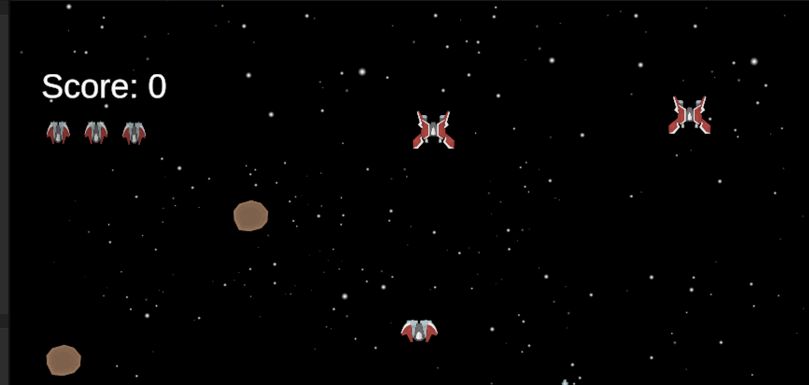

# Meteor Rush

Meteor Rush is a 2D top-down arcade shooter built in Unity. The player moves through the lower half of the play area, shoots enemies, avoids meteors, tracks score, and loses health when hit by enemy fire or hazards.

---

## Features

- Player ship movement
- Player shooting system
- Enemy ship behavior
- Enemy shooting system
- Meteor hazards
- Projectile collisions
- Health system with player icon UI
- Score system with HUD text
- Explosion and hit sound effects
- Game over sequence and scene restart
- Complete arcade gameplay loop

---

## Project Setup

1. Clone or download this repository.
2. Open the project using Unity Hub.
3. Open the `Scenes` folder.
4. Run `SampleScene` to start the project.

---

## Controls

| Action | Key |
|---|---|
| Move | WASD / Arrow Keys |
| Shoot | Left Mouse Button |

---

## Folder Structure

| Folder | Purpose |
|---|---|
| Audio | Sound effects used throughout the game |
| Prefabs | Reusable game objects |
| Scenes | Unity scenes |
| Scripts | Gameplay scripts |
| Sprites | Player, enemy, missile, meteor, and background sprites |

---

## Assets

This project uses assets from the Kenney Space Shooter Extension pack.

Kenney Assets:  
- https://kenney.nl/assets/space-shooter-extension
- https://kenney.nl/assets/sci-fi-sounds
